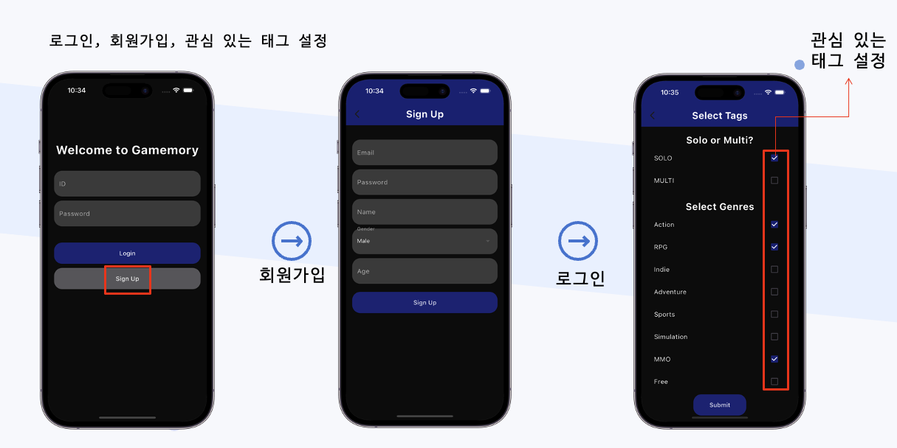

# GAMEMORY

## 프로젝트 소개

GAMEMORY는 아주대학교 데이터베이스 과목 프로젝트로 개발된 게임 추천 시스템입니다. 사용자가 게임을 선택할 때 겪는 어려움을 덜어주고 개인 맞춤형 게임 추천을 제공합니다.

### 주요 기능
- 회원가입 및 로그인
- 사용자 태그 기반 게임 추천
- 게임 세부 정보 조회
- 즐겨찾기 관리

### 사용 기술

- **Flutter**를 사용한 크로스 플랫폼 개발
- **Firebase Firestore** 기반 NoSQL 데이터베이스
- **SteamSpy API**, **Steam Store API** 활용

---

## 데모 및 스크린샷

#### 1. 로그인 및 회원가입, 태그 선택

 

- 사용자는 앱에 가입하거나 기존 계정을 통해 로그인할 수 있습니다.
- Firebase Authentication을 사용하여 안전한 이메일 및 비밀번호 기반 인증을 제공합니다.
#### 2. 게임 추천 결과

 

- 회원가입한 데이터와 즐겨찾기한 데이터는 각각 user 컬렉션과 Favorite 컬렉션에 저장됩니다.
- 선택한 태그를 기반으로 추천된 게임 목록을 확인할 수 있습니다.
- 게임 이름, 이미지, 요약 정보 등을 표시하며, 사용자는 목록에서 게임을 선택할 수 있습니다.

#### 3. 게임 추천 결과, 즐겨찾기 목록 관리

 

- 사용자는 추천된 게임을 즐겨찾기에 추가하거나, 즐겨찾기 목록을 관리할 수 있습니다.
- 게임 목록이 Firebase Firestore의 Favorites 컬렉션에 저장됩니다.
- 특정 게임을 선택하면 Steam Store API를 통해 게임의 세부 정보를 확인할 수 있습니다.

---

## 데이터베이스 

#### ER 다이어그램

 

#### Firestore 데이터베이스 구조
- **users (컬렉션)**:
  - 각 사용자에 대한 정보를 저장하는 컬렉션
  - 필드:
    - `userID`: string (PK, Primary Key)
    - `email`: string
    - `gender`: string
    - `name`: string
    - `password`: string

- **favorites (컬렉션)**:
  - 사용자가 즐겨찾기에 추가한 게임 정보를 저장하는 컬렉션
  - 필드:
    - `appid`: int (PK, Primary Key)
    - `description`: string
    - `image`: string
    - `name`: string

---

## 기술 스택

- **Frontend**: 

    

- **Backend**: 
    
    
- **API**: 

       

---

